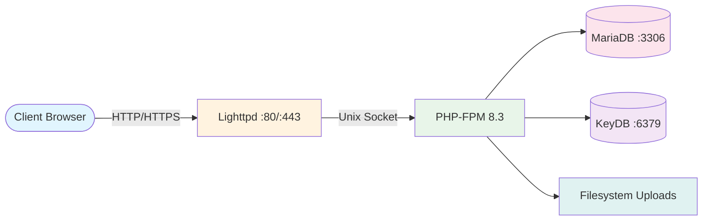

# QuickPress

> One-command ClassicPress installer for Alpine Linux VMs with performance optimizations and SSL support.

[](LICENSE)
[](https://www.gnu.org/software/bash/)
[](https://classicpress.net)

## Overview

**QuickPress** is an end-to-end automated installer that sets up a production-ready [ClassicPress](https://classicpress.net) (WordPress-compatible CMS) instance on Alpine Linux. It configures a high-performance LEMP-like stack optimized for VMs and small servers.

### What's Installed

| Component | Purpose | Optimization |
|-----------|---------|--------------|
| **Lighttpd** | Web server | Event-driven, low memory footprint |
| **PHP 8.3** | Application runtime | OPcache + JIT compilation |
| **MariaDB** | Database | Tuned InnoDB buffer pool |
| **KeyDB** | Object cache | Multi-threaded Redis-compatible |
| **ClassicPress 2.6.0** | CMS | Pre-configured for performance |

## Features

- **⚡ Performance Tuned**: OPcache + JIT, query caching, static file caching, Gzip compression
- **🔒 SSL Ready**: Let's Encrypt auto-renewal or self-signed certificates for IP addresses
- **🚀 One Command**: Single script installation, no manual configuration needed
- **📦 Optimized Stack**: Minimal resource usage suitable for small VMs (1GB+ RAM)
- **🔄 Auto-Maintenance**: Cron jobs for SSL renewal, WP-Cron replacement, permission fixes
- **🖼️ Upload Ready**: Proper permissions and PHP extensions for image/media uploads

## Requirements

- Alpine Linux (3.16+)
- Root access
- 1GB+ RAM recommended
- (Optional) Domain pointed to server for Let's Encrypt SSL

## Quick Start

```bash
# Download and run
wget https://raw.githubusercontent.com/yourusername/quickpress/main/quickpress.sh
chmod +x quickpress.sh
sudo ./quickpress.sh
```

Then open `http://YOUR_SERVER_IP/wp-admin/install.php` to complete ClassicPress setup.

## Usage

### No SSL (HTTP only)
```bash
./quickpress.sh
```

### Let's Encrypt SSL (requires domain)
```bash
./quickpress.sh --ssl-domain example.com --ssl-email admin@example.com
```

### Self-Signed SSL (works with IP addresses)
```bash
./quickpress.sh --ssl-self-signed
```

### Show Help
```bash
./quickpress.sh --help
```

## Performance Optimizations

### PHP 8.3
- **OPcache**: 256MB memory, 10K accelerated files
- **JIT Compiler**: 128MB buffer, tracing mode
- **Upload limits**: 64MB file size, 300s execution time
- **Unix socket**: Faster than TCP for PHP-FPM

### KeyDB (Redis-compatible)
- Multi-threaded (4 threads) for high concurrency
- Memory-optimized cache with LRU eviction
- Auto-configured for ClassicPress object caching

### MariaDB
- InnoDB buffer pool (50% of system RAM)
- Query cache enabled (64MB)
- Optimized connection and thread settings

### Lighttpd
- Event-driven architecture (`linux-sysepoll`)
- Gzip compression for text assets
- Static file caching (1 month for images)
- ETags for cache validation

### ClassicPress Configuration
- Post revisions limited to 3
- Autosave interval: 120s (reduces DB writes)
- WP-Cron disabled (replaced with system cron)
- Direct filesystem (no FTP required)

## Post-Installation

### Enable Object Cache (Recommended)
1. Go to `wp-admin -> Plugins -> Add New`
2. Search: **"Redis Object Cache"** by Till Kruss
3. Install and Activate
4. Go to **Settings -> Redis -> Enable Object Cache**

The plugin auto-connects to KeyDB at `127.0.0.1:6379`.

### Service Management
```bash
# Restart services
service lighttpd restart
service php-fpm83 restart
service mariadb restart
service keydb restart

# Check status
keydb-cli ping           # KeyDB
php -i | grep opcache    # OPcache
lighttpd -V              # Lighttpd version
```

### Troubleshooting Uploads
If file uploads fail:
```bash
# Fix permissions
fix-classicpress-permissions

# Check logs
tail -f /var/log/lighttpd/error.log
tail -f /var/log/php83/error.log

# Verify extensions
php83 -m | grep -E 'gd|exif|imagick'
```

### SSL Certificate Management

**Let's Encrypt:**
```bash
# Manual renewal
~/.acme.sh/acme.sh --cron --home ~/.acme.sh

# View renewal logs
cat /var/log/acme-renewal.log
```

**Self-Signed:**
```bash
# Manual renewal check
/usr/local/bin/renew-selfsigned-cert.sh

# View renewal logs
cat /var/log/selfsigned-renewal.log
```

## File Locations

| Component | Path |
|-----------|------|
| Web Root | `/var/www/classicpress` |
| wp-config.php | `/var/www/classicpress/wp-config.php` |
| Credentials | `/root/classicpress-login.txt` |
| Lighttpd Config | `/etc/lighttpd/lighttpd.conf` |
| PHP Config | `/etc/php83/conf.d/00_opcache.ini` |
| MariaDB Config | `/etc/my.cnf.d/mariadb-server.cnf` |
| KeyDB Config | `/etc/keydb.conf` |
| SSL Certificates | `/etc/ssl/acme/` |
| Log File | `/var/log/classicpress-install.log` |

## Architecture



## Security Features

- File editing disabled in admin (`DISALLOW_FILE_EDIT`)
- Dangerous PHP functions disabled
- Proper file permissions on wp-config.php
- Hidden files denied access
- Security headers enabled (X-Frame-Options, X-Content-Type-Options, etc.)

## License

This project is released into the public domain via the [Unlicense](LICENSE).

## Credits

- [ClassicPress](https://classicpress.net) - The CMS
- [KeyDB](https://docs.keydb.dev/) - Multi-threaded Redis fork
- [Alpine Linux](https://alpinelinux.org/) - Lightweight Linux distribution
